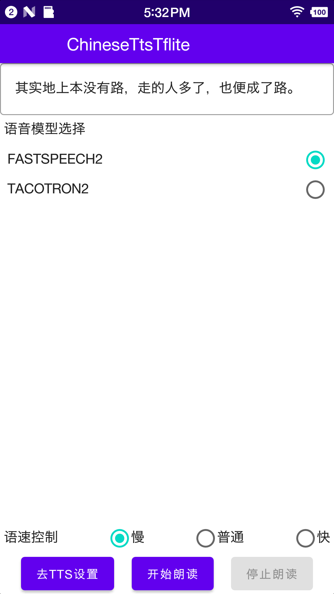

# Chinese TTS TF Lite

[](https://github.com/benjaminwan/ChineseTtsTflite/issues)
[](https://github.com/benjaminwan/ChineseTtsTflite)

### 介绍

使用Kotlin + JetPack Compose + Tensorflow Lite开发的TTS引擎，可以完全离线使用。

可选两种模型：FastSpeech和Tacotron，这两种模型均来自[TensorFlowTTS](https://github.com/TensorSpeech/TensorFlowTTS)

文字转拼音方法来自：[TensorflowTTS_chinese](https://github.com/tatans-coder/TensorflowTTS_chinese)

因为是实时推理输出音频，故对设备性能有一定要求。

其中FastSpeech速度较快，但生成的音频拟人效果较差，可以用于普通中端以上手机。

而Tacotron对性能要求较高，虽然总体效果更好，但因为速度很慢，故目前实用价值不大，仅供测试。

### 手动编译说明

1. Android 2021.1.1 Patch 1
2. 从下面的模型下载地址，下载models-tflite.7z，把如下4个文件解压到对应目录

```
├─app/src/main/assets
│      baker_mapper.json
│      fastspeech2_quan.tflite
│      mb_melgan.tflite
│      tacotron2_quan.tflite
   ```

3. 编译

```shell
./gradlew assembleRelease
```

### 模型下载

[下载地址](https://github.com/benjaminwan/ChineseTtsTflite/releases/tag/init)

- models-tf.7z : 原始TensorflowTTS模型，一般用于PC端
- models-tflite.7z : 转换后的TFLite模型，一般用于移动端

### 模型查看

[netron](https://github.com/lutzroeder/netron/releases)

### 参考资料

[TensorFlowTTS](https://github.com/TensorSpeech/TensorFlowTTS)

[TensorflowTTS_chinese](https://github.com/tatans-coder/TensorflowTTS_chinese)

[tensorflow指南](https://www.tensorflow.org/lite/guide/android)

[参考tf测试](https://colab.research.google.com/drive/1YpSHRBRPBI7cnTkQn1UcVTWEQVbsUm1S?usp=sharing)

[参考tflite转换](https://colab.research.google.com/drive/1Ma3MIcSdLsOxqOKcN1MlElncYMhrOg3J?usp=sharing)

[Google Pico TTS Source](https://android.googlesource.com/platform/external/svox/)

### 模型测试&转换

#### 转换环境配置

- Ubuntu: 20.04 LTS
- Python: 3.8

```shell
$ git clone https://github.com/TensorSpeech/TensorFlowTTS.git
$ cd TensorFlowTTS
$ pip install .
$ pip install git+https://github.com/repodiac/german_transliterate.git
```

#### 解压models-tf.7z

#### TF模型测试

```shell
$ cd models-tf
$ python test-h5.py
```

#### TF模型转TFLite

```shell
$ python convert-tflite.py
```

### APP界面截图


